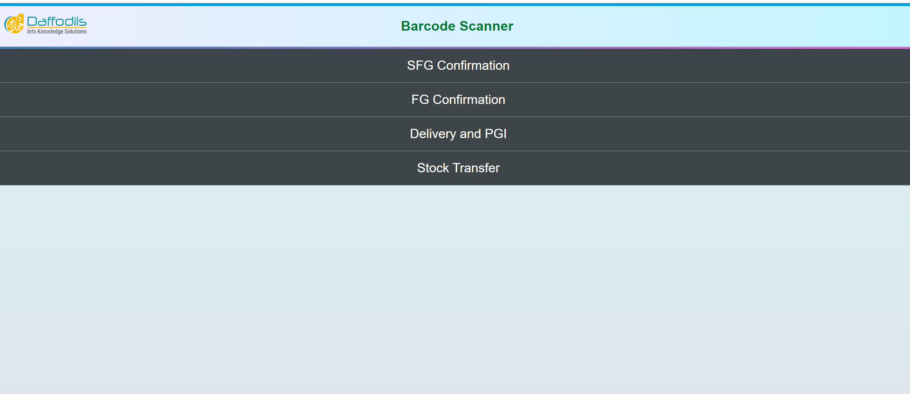
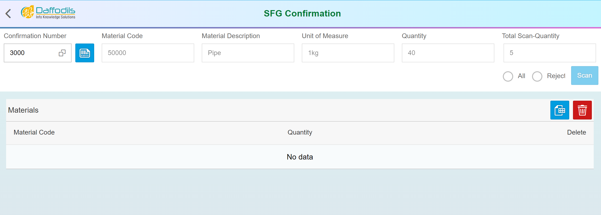
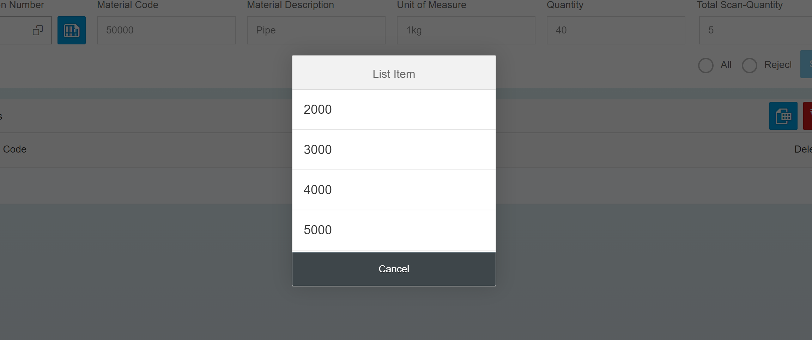
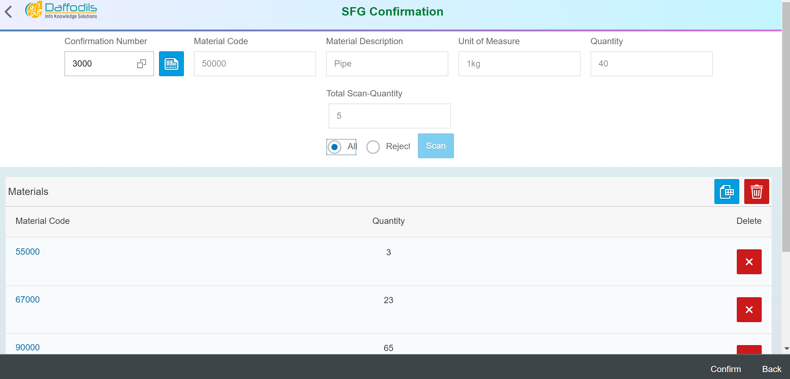

# BarcodeScanner-SAPUI5
<h2> Task : Barcode Scanner</h2>
<h3>Company Name : Daffodils Info Knowledge Solutions</h3>
<h5> images from application below </h5> 

First Page

Second Page same as third and four page design but functionality is differents

Dialog 

show data to the Table

